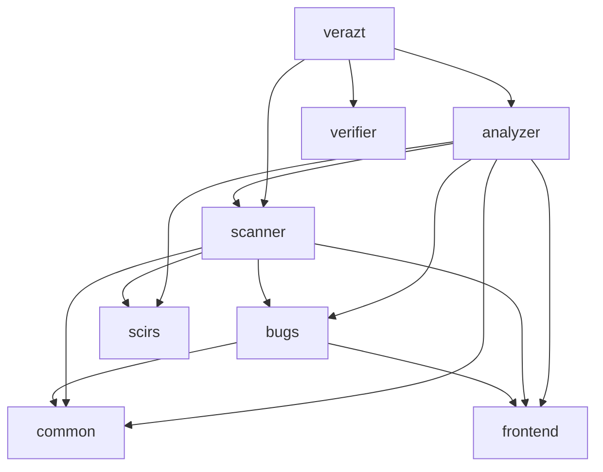

# Plan: Extract Scanning Detectors into a Standalone `scanner` Crate

## Motivation

All 21 SIR detectors use **syntactic pattern matching** (tree-walking via the
`Visit` trait). None of them use any of the 3 analysis frameworks
(`dfa/`, `cfa/`, `datalog/`) in the `analyzer` crate. Colocating them creates
confusion about which detector relies on which framework.

Extracting these into a dedicated `crates/scanner` crate and exposing a
`verazt scan` CLI command:

- Makes the "no framework needed" nature explicit
- Enables fast, standalone scanning (`verazt scan`)
- Keeps `analyzer` focused on framework-backed deep analysis
- Establishes a clean dependency boundary with no circular deps

---

## Architecture Overview

### Before

```
verazt ──→ analyzer (21 SIR detectors + frameworks + pipeline)
       ──→ verifier
```

### After

```
verazt ──→ scanner   (21 scan rules, own CLI, own trait)
       ──→ analyzer (framework-backed detectors, imports scanner rules)
       ──→ verifier
```

### Dependency Graph



**Key**: `scanner` does NOT depend on `analyzer`. Instead, `analyzer` depends
on `scanner` and wraps its rules into the analyzer pipeline.

---

## Phase 1: Define the `ScanDetector` Trait and Scan Engine

The scanner defines its own lightweight trait, completely decoupled from
`analyzer`'s `Pass`/`AnalysisContext`/`BugDetectionPass` machinery.

### Naming: "Detectors" not "Rules"

We use **"detectors"** rather than "rules" because:

- These find *security vulnerabilities*, not style violations
- Consistency with existing terminology (`DetectorId`,
  `DetectorRegistry`, `BugDetectionPass`)
- "Rule" implies suppressible style checks; "detector" implies
  actionable security findings

### 1.1 Design: Level-based dispatch (single-pass architecture)

**Problem with the current design**: Each of the 21 detectors
independently traverses the full SIR AST (via the `Visit` trait or
manual `for` loops). That's 21 redundant walks over the same tree.
Each detector also carries boilerplate to track `current_contract`
and `current_function` context.

**Inspiration from `analyzer`**: The analyzer's `PassLevel` enum
(`Program`, `Contract`, `Function`, `Statement`, `Expression`)
cleanly categorizes the granularity at which a pass operates. We
adopt this same hierarchy for scanner detectors.

**Solution**: A single `ScanEngine` walks the SIR hierarchy **once**.
At each level, it dispatches to all detectors registered for that
level, passing the relevant context:

```
ScanEngine walks:  Module → Contract → Function
                      │         │          │
                      │         │          └─ FrontRunningDetector
                      │         │             ShortAddressDetector
                      │         │             ShadowingDetector ...
                      │         │
                      │         └─ CentralizationRiskDetector
                      │            UninitializedDetector
                      │            VisibilityDetector ...
                      │
                      └─ FloatingPragmaDetector
```

**What we reuse from the analyzer**:

| Analyzer concept | Scanner equivalent | Reused? |
|---|---|---|
| `PassLevel` enum | `DetectionLevel` enum | ✅ Same idea, simplified (3 levels instead of 7) |
| `PassManager` (scheduler + executor) | `ScanEngine` | ✅ Execution pattern, but no dependency graph |
| `PassExecutionInfo` (timing) | `ScanReport` | ✅ Timing and result reporting |
| `AnalysisContext` | Not needed | ❌ Detectors are stateless; context passed as args |
| `DependencyGraph` | Not needed | ❌ Scan detectors are independent |

### 1.2 New file: `crates/scanner/src/detector.rs`

```rust
use bugs::bug::{Bug, BugCategory, BugKind, RiskLevel};
use scirs::sir::{ContractDecl, FunctionDecl, Module};

/// Confidence level for a scan finding.
#[derive(Debug, Clone, Copy, PartialEq, Eq, PartialOrd, Ord, Hash)]
pub enum Confidence {
    Low,
    Medium,
    High,
}

/// Target platform that a detector applies to.
#[derive(Debug, Clone, Copy, PartialEq, Eq, Hash)]
pub enum Target {
    /// Only applicable to EVM-based languages (Solidity, Vyper).
    Evm,
    /// Only applicable to Move-based languages (Sui, Aptos).
    Move,
    /// Only applicable to Solana programs.
    Solana,
}

/// The SIR hierarchy level at which a detector operates.
///
/// Inspired by `analyzer::PassLevel`, but simplified to the three
/// levels that scanner detectors actually need. The `ScanEngine`
/// uses this to dispatch detectors during its single-pass walk.
#[derive(Debug, Clone, Copy, PartialEq, Eq, Hash)]
pub enum DetectionLevel {
    /// Operates on whole modules (e.g., pragma checks).
    Module,
    /// Operates on individual contracts (e.g., access control, state vars).
    Contract,
    /// Operates on individual functions (e.g., reentrancy, front-running).
    Function,
}

/// A lightweight scan detector that operates on SIR at a specific level.
///
/// Unlike `analyzer::BugDetectionPass`, this trait has no dependency on
/// `Pass`, `AnalysisContext`, or any analysis framework.
///
/// Each detector declares its `level()`, and only the corresponding
/// `check_*` method is called by the `ScanEngine` during its single
/// walk of the SIR tree.
pub trait ScanDetector: Send + Sync {
    // ── Identity ────────────────────────────────────────

    /// Stable kebab-case identifier (e.g., `"front-running"`).
    fn id(&self) -> &'static str;

    /// Human-readable name (e.g., `"Front Running"`).
    fn name(&self) -> &'static str;

    /// Short description of what this detector checks.
    fn description(&self) -> &'static str;

    // ── Classification ─────────────────────────────────

    /// The kind of issue this detector finds.
    fn bug_kind(&self) -> BugKind;

    /// The vulnerability category.
    fn bug_category(&self) -> BugCategory;

    /// The risk level of findings.
    fn risk_level(&self) -> RiskLevel;

    /// Confidence level of detection.
    fn confidence(&self) -> Confidence;

    /// Target platform this detector applies to.
    fn target(&self) -> Target;

    /// The SIR level at which this detector operates.
    fn level(&self) -> DetectionLevel;

    /// Associated CWE IDs.
    fn cwe_ids(&self) -> Vec<usize>;

    /// Associated SWC IDs (empty for non-EVM detectors).
    fn swc_ids(&self) -> Vec<usize> { vec![] }

    /// Fix recommendation.
    fn recommendation(&self) -> &'static str { "" }

    /// Reference URLs.
    fn references(&self) -> Vec<&'static str> { vec![] }

    // ── Detection (only one is called, based on level()) ──

    /// Check a module. Called when `level() == Module`.
    fn check_module(&self, _module: &Module) -> Vec<Bug> { vec![] }

    /// Check a contract. Called when `level() == Contract`.
    fn check_contract(
        &self,
        _contract: &ContractDecl,
        _module: &Module,
    ) -> Vec<Bug> { vec![] }

    /// Check a function. Called when `level() == Function`.
    fn check_function(
        &self,
        _func: &FunctionDecl,
        _contract: &ContractDecl,
        _module: &Module,
    ) -> Vec<Bug> { vec![] }
}
```

**Key design decisions**:

- **Three levels** (Module, Contract, Function) instead of the analyzer's
  seven. Statement/Expression-level detectors implement `check_function`
  and do their own sub-walk within the function body — this is simpler
  than splitting into 5+ levels and matches how all 14 visitor-based
  detectors already work (they override `visit_function_decl` and walk
  down from there).

- **Context passed as arguments**: `check_function` receives the parent
  `ContractDecl` and `Module` so detectors that need cross-function
  context (e.g., `front_running` comparing public functions) can access
  sibling functions without a separate walk.

- **No `check(&self, modules: &[Module])`**: The engine controls the
  walk. Detectors never see the full module list — they see only their
  relevant scope. This prevents detectors from accidentally doing their
  own full traversal.

### 1.3 New file: `crates/scanner/src/engine.rs`

The `ScanEngine` performs a **single walk** of the SIR hierarchy and
dispatches to detectors pre-grouped by level.

```rust
use crate::detector::{DetectionLevel, ScanDetector};
use bugs::bug::Bug;
use scirs::sir::{Decl, MemberDecl, Module};
use std::time::Instant;

/// Configuration for the scan engine.
#[derive(Debug, Clone)]
pub struct ScanConfig {
    /// Enable timing information.
    pub timing: bool,
    /// Enable verbose logging.
    pub verbose: bool,
}

impl Default for ScanConfig {
    fn default() -> Self {
        Self { timing: true, verbose: false }
    }
}

/// Result of a scan run.
#[derive(Debug)]
pub struct ScanReport {
    pub bugs: Vec<Bug>,
    pub detectors_run: usize,
    pub duration: std::time::Duration,
}

/// The scan engine: single-pass AST walker with level-based dispatch.
pub struct ScanEngine {
    config: ScanConfig,
    /// Detectors grouped by detection level for O(1) dispatch.
    module_detectors: Vec<Box<dyn ScanDetector>>,
    contract_detectors: Vec<Box<dyn ScanDetector>>,
    function_detectors: Vec<Box<dyn ScanDetector>>,
}

impl ScanEngine {
    pub fn new(config: ScanConfig, detectors: Vec<Box<dyn ScanDetector>>) -> Self {
        let mut module_detectors = Vec::new();
        let mut contract_detectors = Vec::new();
        let mut function_detectors = Vec::new();

        for d in detectors {
            match d.level() {
                DetectionLevel::Module => module_detectors.push(d),
                DetectionLevel::Contract => contract_detectors.push(d),
                DetectionLevel::Function => function_detectors.push(d),
            }
        }

        Self { config, module_detectors, contract_detectors, function_detectors }
    }

    /// Run all detectors on the given SIR modules.
    /// Performs exactly ONE walk of the SIR hierarchy.
    pub fn run(&self, modules: &[Module]) -> ScanReport {
        let start = Instant::now();
        let mut bugs = Vec::new();
        let detectors_run = self.module_detectors.len()
            + self.contract_detectors.len()
            + self.function_detectors.len();

        for module in modules {
            // ── Module-level detectors ──────────────────
            for d in &self.module_detectors {
                bugs.extend(d.check_module(module));
            }

            // ── Walk contracts ──────────────────────────
            for decl in &module.decls {
                if let Decl::Contract(contract) = decl {
                    // ── Contract-level detectors ────────
                    for d in &self.contract_detectors {
                        bugs.extend(d.check_contract(contract, module));
                    }

                    // ── Walk functions ──────────────────
                    for member in &contract.members {
                        if let MemberDecl::Function(func) = member {
                            // ── Function-level detectors
                            for d in &self.function_detectors {
                                bugs.extend(
                                    d.check_function(func, contract, module)
                                );
                            }
                        }
                    }
                }
            }
        }

        ScanReport {
            bugs,
            detectors_run,
            duration: start.elapsed(),
        }
    }
}
```

**Why this works for all 21 detectors**:

| Current pattern | New level | Why it works |
|---|---|---|
| 7 detectors with manual `for module/contract/func` loops | `Contract` | They iterate contract members — `check_contract` gives them the `ContractDecl` directly |
| 14 detectors using `Visit` trait | `Function` | They override `visit_function_decl` + walk down — `check_function` gives them the `FunctionDecl` and they do their sub-walk within the function body |
| `front_running` (needs sibling functions) | `Contract` | Receives `ContractDecl` containing all member functions |
| `floating_pragma` (checks module pragmas) | `Module` | Receives full `Module` |

### 1.4 Detector level classification

| Level | Detectors | Count |
|---|---|---|
| **Module** | `floating_pragma` | 1 |
| **Contract** | `centralization_risk`, `constant_state_var`, `dead_code`, `front_running`, `missing_access_control`, `uninitialized`, `visibility` | 7 |
| **Function** | `arithmetic_overflow`, `bad_randomness`, `cei_violation`, `delegatecall`, `denial_of_service`, `deprecated_features`, `low_level_call`, `reentrancy`, `shadowing`, `short_address`, `timestamp_dependence`, `tx_origin`, `unchecked_call` | 13 |

---

## Phase 2: Scaffold the `scanner` Crate

### 2.1 Directory structure

Detectors are grouped by **two axes**:

1. **Target dialect** — each dialect (EVM, Move, Solana) gets its own
   top-level sub-module. Future dialects just add a new directory.
2. **Detection level** (within each dialect: `module/`, `contract/`,
   `function/`) — mirrors the `ScanEngine`’s dispatch order and the
   `DetectionLevel` enum. When writing a new detector, you know
   exactly where it goes based on the SIR node it inspects.

```
crates/scanner/
├── Cargo.toml
└── src/
    ├── lib.rs
    ├── cli.rs                  # CLI entry for `verazt scan`
    ├── detector.rs             # ScanDetector trait + Confidence + Target + DetectionLevel
    ├── engine.rs               # ScanEngine: single-pass walker with level dispatch
    ├── registry.rs             # ScanRegistry + register_all()
    └── detectors/
        ├── mod.rs              # Re-exports from all sub-modules
        └── evm/                # EVM dialect (Solidity/Vyper)
            ├── mod.rs
            ├── module/         # DetectionLevel::Module (1)
            │   ├── mod.rs
            │   └── floating_pragma.rs
            ├── contract/       # DetectionLevel::Contract (7)
            │   ├── mod.rs
            │   ├── centralization_risk.rs
            │   ├── constant_state_var.rs
            │   ├── dead_code.rs
            │   ├── front_running.rs
            │   ├── missing_access_control.rs
            │   ├── uninitialized.rs
            │   └── visibility.rs
            └── function/       # DetectionLevel::Function (13)
                ├── mod.rs
                ├── arithmetic_overflow.rs
                ├── bad_randomness.rs
                ├── cei_violation.rs
                ├── delegatecall.rs
                ├── denial_of_service.rs
                ├── deprecated_features.rs
                ├── low_level_call.rs
                ├── reentrancy.rs
                ├── shadowing.rs
                ├── short_address.rs
                ├── timestamp_dependence.rs
                ├── tx_origin.rs
                └── unchecked_call.rs
```

### 2.2 Detector classification

| Detector | Location | Level | BugKind | Risk |
|---|---|---|---|---|
| `floating_pragma` | `evm/module/` | Module | Refactoring | Low |
| `centralization_risk` | `evm/contract/` | Contract | Vulnerability | Medium |
| `constant_state_var` | `evm/contract/` | Contract | Optimization | Low |
| `dead_code` | `evm/contract/` | Contract | Refactoring | Low |
| `front_running` | `evm/contract/` | Contract | Vulnerability | Medium |
| `missing_access_control` | `evm/contract/` | Contract | Vulnerability | High |
| `uninitialized` | `evm/contract/` | Contract | Vulnerability | High |
| `visibility` | `evm/contract/` | Contract | Vulnerability | Medium |
| `arithmetic_overflow` | `evm/function/` | Function | Vulnerability | High |
| `bad_randomness` | `evm/function/` | Function | Vulnerability | High |
| `cei_violation` | `evm/function/` | Function | Vulnerability | High |
| `delegatecall` | `evm/function/` | Function | Vulnerability | High |
| `denial_of_service` | `evm/function/` | Function | Vulnerability | High |
| `deprecated_features` | `evm/function/` | Function | Refactoring | Low |
| `low_level_call` | `evm/function/` | Function | Vulnerability | Medium |
| `reentrancy` | `evm/function/` | Function | Vulnerability | Critical |
| `shadowing` | `evm/function/` | Function | Refactoring | Low |
| `short_address` | `evm/function/` | Function | Vulnerability | Low |
| `timestamp_dependence` | `evm/function/` | Function | Vulnerability | Low |
| `tx_origin` | `evm/function/` | Function | Vulnerability | High |
| `unchecked_call` | `evm/function/` | Function | Vulnerability | Medium |

### 2.3 Module structure (`detectors/mod.rs`)

```rust
//! Scan Detectors
//!
//! Grouped by dialect and detection level:
//!
//! - `evm/module/`    — EVM module-level detectors
//! - `evm/contract/`  — EVM contract-level detectors
//! - `evm/function/`  — EVM function-level detectors
//!
//! Future dialects add new sub-modules:
//! - `move/module/`, `move/contract/`, `move/function/`

pub mod evm;

// Re-export all detector types for convenience
pub use evm::*;
```

### 2.4 `Cargo.toml`

```toml
[package]
name = "scanner"
version.workspace = true
authors.workspace = true
license.workspace = true
edition.workspace = true

[dependencies]
bugs = { workspace = true }
common = { workspace = true }
frontend = { workspace = true }
scirs = { workspace = true }
log = { workspace = true }
clap = { workspace = true }
clap-verbosity-flag = { workspace = true }
env_logger = { workspace = true }
rayon = { workspace = true }
serde_json = { workspace = true }
```

### 2.5 `lib.rs`

```rust
//! Scanner — Syntactic Pattern-Matching Security Detectors
//!
//! Fast, lightweight security checks that operate on the SIR
//! representation via a single-pass tree walk. No dataflow,
//! control-flow, or Datalog frameworks are used.
//!
//! ## Architecture
//!
//! The `ScanEngine` walks the SIR hierarchy (Module → Contract →
//! Function) exactly **once**, dispatching to detectors at each level.
//! This eliminates the 21× redundant traversals of the previous design.
//!
//! ## Organization
//!
//! Detectors are grouped by dialect and detection level:
//!
//! - `detectors/evm/module/`    — Module-level detectors
//! - `detectors/evm/contract/`  — Contract-level detectors
//! - `detectors/evm/function/`  — Function-level detectors
//!
//! ## Usage
//!
//! Run standalone via `verazt scan` or as part of the full analysis
//! pipeline via `verazt analyze`.

pub mod cli;
pub mod detector;
pub mod detectors;
pub mod engine;
pub mod registry;

pub use detector::{Confidence, DetectionLevel, ScanDetector, Target};
pub use engine::{ScanConfig, ScanEngine, ScanReport};
pub use registry::{ScanRegistry, register_all_detectors};
```

---

## Phase 3: Define the Scan Registry

### 3.1 New file: `crates/scanner/src/registry.rs`

```rust
use crate::detector::{ScanDetector, Target};

/// Registry for scan detectors.
pub struct ScanRegistry {
    detectors: Vec<Box<dyn ScanDetector>>,
}

impl ScanRegistry {
    pub fn new() -> Self { Self { detectors: Vec::new() } }

    pub fn register(&mut self, detector: Box<dyn ScanDetector>) {
        self.detectors.push(detector);
    }

    pub fn all(&self) -> &[Box<dyn ScanDetector>] { &self.detectors }

    /// Filter detectors by target platform.
    pub fn for_target(&self, target: Target) -> Vec<&dyn ScanDetector> {
        self.detectors
            .iter()
            .filter(|d| d.target() == target)
            .map(|d| d.as_ref())
            .collect()
    }

    /// Consume the registry and return owned detectors (for adapter use).
    pub fn into_detectors(self) -> Vec<Box<dyn ScanDetector>> {
        self.detectors
    }

    pub fn len(&self) -> usize { self.detectors.len() }
    pub fn is_empty(&self) -> bool { self.detectors.is_empty() }
}

/// Register all built-in scan detectors.
pub fn register_all_detectors(registry: &mut ScanRegistry) {
    use crate::detectors::*;

    // ── Security: EVM ───────────────────────────────────────────
    registry.register(Box::new(ArithmeticOverflowDetector::new()));
    registry.register(Box::new(BadRandomnessDetector::new()));
    registry.register(Box::new(CeiViolationDetector::new()));
    registry.register(Box::new(CentralizationRiskDetector::new()));
    registry.register(Box::new(DelegatecallDetector::new()));
    registry.register(Box::new(DenialOfServiceDetector::new()));
    registry.register(Box::new(FrontRunningDetector::new()));
    registry.register(Box::new(LowLevelCallDetector::new()));
    registry.register(Box::new(MissingAccessControlDetector::new()));
    registry.register(Box::new(ReentrancyDetector::new()));
    registry.register(Box::new(ShortAddressDetector::new()));
    registry.register(Box::new(TimestampDependenceDetector::new()));
    registry.register(Box::new(TxOriginDetector::new()));
    registry.register(Box::new(UncheckedCallDetector::new()));
    registry.register(Box::new(UninitializedDetector::new()));

    // ── Quality: EVM ────────────────────────────────────────────
    registry.register(Box::new(ConstantStateVarDetector::new()));
    registry.register(Box::new(DeadCodeDetector::new()));
    registry.register(Box::new(DeprecatedFeaturesDetector::new()));
    registry.register(Box::new(FloatingPragmaDetector::new()));
    registry.register(Box::new(ShadowingDetector::new()));
    registry.register(Box::new(VisibilityDetector::new()));
}
```

**Key**: The registry filters detectors by `Target`. When adding a new
dialect (e.g., Move), register its detectors in a separate block.
The `for_target()` method selects only the matching detectors at runtime.

---

## Phase 4: Migrate the 21 Detector Files

Each file in `analyzer/src/detectors/sir/*.rs` is migrated to the
appropriate subdirectory in `scanner/src/detectors/` based on the
classification table in Phase 2.

### 4.1 Import rewriting (applied to all 21 files)

**Before** (in `analyzer`):

```rust
use crate::context::AnalysisContext;
use crate::detectors::base::id::DetectorId;
use crate::detectors::{BugDetectionPass, ConfidenceLevel, DetectorResult};
use crate::passes::base::Pass;
use crate::passes::base::meta::PassLevel;
use crate::passes::base::meta::PassRepresentation;
use bugs::bug::{Bug, BugCategory, BugKind, RiskLevel};
use frontend::solidity::ast::Loc;
use scirs::sir::...;
use std::any::TypeId;
```

**After** (in `scanner`):

```rust
use crate::detector::{Confidence, DetectionLevel, ScanDetector, Target};
use bugs::bug::{Bug, BugCategory, BugKind, RiskLevel};
use frontend::solidity::ast::Loc;
use scirs::sir::...;
```

Removed: `AnalysisContext`, `DetectorId`, `Pass`, `PassLevel`,
`PassRepresentation`, `TypeId` — none of these are needed.

### 4.2 Trait implementation rewriting

**Before** (each detector implements two traits, one `check()` with full traversal):

```rust
impl Pass for FrontRunningSirDetector {
    fn name(&self) -> &'static str { "Front Running" }
    fn level(&self) -> PassLevel { PassLevel::Function }
    fn representation(&self) -> PassRepresentation { PassRepresentation::Ir }
    fn dependencies(&self) -> Vec<TypeId> { vec![] }
    ...
}

impl BugDetectionPass for FrontRunningSirDetector {
    fn detect(&self, context: &AnalysisContext) -> DetectorResult<Vec<Bug>> {
        if !context.has_ir() { return Ok(vec![]); }
        let mut visitor = Visitor { ... };
        visitor.visit_modules(context.ir_units()); // full tree walk!
        Ok(bugs)
    }
    ...
}
```

**After** (single trait, level-scoped method, no redundant traversal):

```rust
impl ScanDetector for FrontRunningDetector {
    fn id(&self) -> &'static str { "front-running" }
    fn name(&self) -> &'static str { "Front Running" }
    fn description(&self) -> &'static str { "..." }
    fn bug_kind(&self) -> BugKind { BugKind::Vulnerability }
    fn bug_category(&self) -> BugCategory { BugCategory::FrontRunning }
    fn risk_level(&self) -> RiskLevel { RiskLevel::Medium }
    fn confidence(&self) -> Confidence { Confidence::Medium }
    fn target(&self) -> Target { Target::Evm }
    fn level(&self) -> DetectionLevel { DetectionLevel::Contract }
    fn cwe_ids(&self) -> Vec<usize> { vec![362] }
    fn swc_ids(&self) -> Vec<usize> { vec![114] }

    fn check_contract(
        &self,
        contract: &ContractDecl,
        _module: &Module,
    ) -> Vec<Bug> {
        // Analyze all functions within this contract for
        // front-running patterns. No need to walk the full tree —
        // the engine already positioned us at the contract.
    }
}
```

### 4.3 Migration by level

#### Module-level detectors (1 detector)

These implement `check_module`. The engine calls them once per module.

| Detector | `check_module` logic |
|---|---|
| `floating_pragma` | Check `module.pragmas` for non-pinned versions |

#### Contract-level detectors (7 detectors)

These implement `check_contract`. The engine calls them once per contract.
They receive the full `ContractDecl` and can iterate its members.

| Detector | `check_contract` logic |
|---|---|
| `centralization_risk` | Check for single-owner patterns in contract |
| `constant_state_var` | Find state vars that are never modified |
| `dead_code` | Find unreachable functions in contract |
| `front_running` | Compare public functions for TOD patterns |
| `missing_access_control` | Check public state-modifying functions |
| `uninitialized` | Find storage vars without initialization |
| `visibility` | Check for missing explicit visibility |

#### Function-level detectors (13 detectors)

These implement `check_function`. The engine calls them once per function.
They receive `FunctionDecl` + parent `ContractDecl` for context.

Detectors that currently use the `Visit` trait retain their internal
visitor structs but scope the walk to the function body instead of the
full module tree:

```rust
// Before: walked the entire module tree
visitor.visit_modules(context.ir_units());

// After: walks only this function's body
if let Some(body) = &func.body {
    for stmt in body {
        visitor.visit_stmt(stmt);
    }
}
```

| Detector | `check_function` logic |
|---|---|
| `arithmetic_overflow` | Walk function body for unchecked arithmetic |
| `bad_randomness` | Walk for `block.timestamp` in randomness |
| `cei_violation` | Walk for state changes after external calls |
| `delegatecall` | Walk for `delegatecall` usage |
| `denial_of_service` | Walk for unbounded loops, assert in loops |
| `deprecated_features` | Walk for deprecated Solidity features |
| `low_level_call` | Walk for low-level call patterns |
| `reentrancy` | Walk for external calls before state changes |
| `shadowing` | Check locals that shadow state vars |
| `short_address` | Check parameter validation patterns |
| `timestamp_dependence` | Walk for `block.timestamp` in conditions |
| `tx_origin` | Walk for `tx.origin` usage |
| `unchecked_call` | Walk for unchecked return values |

### 4.4 Struct renaming

| Old name (in `analyzer`) | New name (in `scanner`) | Location |
|---|---|---|
| `FloatingPragmaSirDetector` | `FloatingPragmaDetector` | `evm/module/` |
| `CentralizationRiskSirDetector` | `CentralizationRiskDetector` | `evm/contract/` |
| `ConstantStateVarSirDetector` | `ConstantStateVarDetector` | `evm/contract/` |
| `DeadCodeSirDetector` | `DeadCodeDetector` | `evm/contract/` |
| `FrontRunningSirDetector` | `FrontRunningDetector` | `evm/contract/` |
| `MissingAccessControlSirDetector` | `MissingAccessControlDetector` | `evm/contract/` |
| `UninitializedSirDetector` | `UninitializedDetector` | `evm/contract/` |
| `VisibilitySirDetector` | `VisibilityDetector` | `evm/contract/` |
| `ArithmeticOverflowSirDetector` | `ArithmeticOverflowDetector` | `evm/function/` |
| `BadRandomnessSirDetector` | `BadRandomnessDetector` | `evm/function/` |
| `CeiViolationSirDetector` | `CeiViolationDetector` | `evm/function/` |
| `DelegatecallSirDetector` | `DelegatecallDetector` | `evm/function/` |
| `DenialOfServiceSirDetector` | `DenialOfServiceDetector` | `evm/function/` |
| `DeprecatedSirDetector` | `DeprecatedFeaturesDetector` | `evm/function/` |
| `LowLevelCallSirDetector` | `LowLevelCallDetector` | `evm/function/` |
| `ReentrancySirDetector` | `ReentrancyDetector` | `evm/function/` |
| `ShadowingSirDetector` | `ShadowingDetector` | `evm/function/` |
| `ShortAddressSirDetector` | `ShortAddressDetector` | `evm/function/` |
| `TimestampDependenceSirDetector` | `TimestampDependenceDetector` | `evm/function/` |
| `TxOriginSirDetector` | `TxOriginDetector` | `evm/function/` |
| `UncheckedCallSirDetector` | `UncheckedCallDetector` | `evm/function/` |

---

## Phase 5: Build the `verazt scan` CLI

### 5.1 New file: `crates/scanner/src/cli.rs`

The scan CLI follows the same pattern as `compile.rs`: it parses
Solidity/Vyper, lowers to SIR, then runs all applicable scan detectors.

```rust
//! `verazt scan` — fast syntactic security checks

use clap::Parser;

#[derive(Parser, Debug)]
#[command(about = "Run fast syntactic security scan checks")]
pub struct Args {
    /// Input smart contract files
    pub input_files: Vec<String>,

    /// Input language override (solidity, vyper)
    #[arg(long)]
    pub language: Option<String>,

    // Solidity options
    #[arg(long)]
    pub base_path: Option<String>,
    #[arg(long)]
    pub include_path: Vec<String>,
    #[arg(long)]
    pub solc_version: Option<String>,

    /// Output format: text, json
    #[arg(long, short, default_value = "text")]
    pub format: String,

    /// List of detector IDs to enable (comma-separated)
    #[arg(long)]
    pub enable: Option<String>,

    /// List of detector IDs to disable (comma-separated)
    #[arg(long)]
    pub disable: Option<String>,

    /// Enable parallel execution
    #[arg(long)]
    pub parallel: bool,

    /// List available scan detectors
    #[arg(long)]
    pub list_detectors: bool,
}

pub fn run<I, T>(args_iter: I)
where
    I: IntoIterator<Item = T>,
    T: Into<std::ffi::OsString> + Clone,
{
    // 1. Parse CLI args
    // 2. If --list-detectors, print table and exit
    // 3. Detect target platform from file extension / --language
    // 4. For each input file:
    //    a. Parse (Solidity/Vyper)
    //    b. Lower to SIR
    // 5. Create registry, filter by target + enable/disable
    // 6. Build ScanEngine and run single-pass dispatch
    let mut registry = ScanRegistry::new();
    register_all_detectors(&mut registry);
    let detectors = registry.into_detectors();
    let engine = ScanEngine::new(ScanConfig::default(), detectors);
    let report = engine.run(&modules);
    // 7. Format output, print report.bugs
}
```

**Language-aware filtering flow**:

```
Input: contract.sol → target = Evm
  → Run: evm/module/* + evm/contract/* + evm/function/*

Input: contract.vy → target = Evm
  → Run: evm/module/* + evm/contract/* + evm/function/*

Input: contract.move → target = Move (future)
  → Run: move/module/* + move/contract/* + move/function/*
```

### 5.2 Wire into `verazt` binary

#### Modify `crates/verazt/src/main.rs`

```rust
#[derive(Subcommand, Debug)]
enum Commands {
    Compile(compile::Args),
    #[command(trailing_var_arg = true, allow_hyphen_values = true)]
    Analyze { args: Vec<String> },
    /// Run fast syntactic security scan checks
    #[command(trailing_var_arg = true, allow_hyphen_values = true)]
    Scan { args: Vec<String> },
    #[command(trailing_var_arg = true, allow_hyphen_values = true)]
    Verify { args: Vec<String> },
}

// In main():
Commands::Scan { args } => {
    let mut all_args = vec!["verazt scan".to_string()];
    all_args.extend(args);
    scanner::cli::run(all_args);
}
```

#### Modify `crates/verazt/Cargo.toml`

```toml
[dependencies]
scanner = { workspace = true }   # NEW
```

---

## Phase 6: Update `analyzer` to Import Scan Detectors

The `analyzer` should continue running scan detectors as part of
`verazt analyze`. It wraps `ScanDetector` instances into its
`BugDetectionPass` trait via an adapter.

### 6.1 New file: `analyzer/src/detectors/scan_adapter.rs`

```rust
//! Adapter: wraps scanner::ScanDetector → analyzer::BugDetectionPass

use crate::context::AnalysisContext;
use crate::detectors::{BugDetectionPass, ConfidenceLevel, DetectorResult};
use crate::detectors::base::id::DetectorId;
use crate::passes::base::Pass;
use crate::passes::base::meta::{PassLevel, PassRepresentation};
use scanner::ScanDetector;

/// Wraps a ScanDetector so it can participate in the analyzer pipeline.
pub struct ScanDetectorAdapter {
    detector: Box<dyn ScanDetector>,
}

impl ScanDetectorAdapter {
    pub fn new(detector: Box<dyn ScanDetector>) -> Self {
        Self { detector }
    }
}

impl Pass for ScanDetectorAdapter {
    fn name(&self) -> &'static str { self.detector.name() }
    fn description(&self) -> &'static str { self.detector.description() }
    fn level(&self) -> PassLevel { PassLevel::Function }
    fn representation(&self) -> PassRepresentation { PassRepresentation::Ir }
    fn dependencies(&self) -> Vec<std::any::TypeId> { vec![] }
}

impl BugDetectionPass for ScanDetectorAdapter {
    fn detector_id(&self) -> DetectorId {
        DetectorId::from_str(self.detector.id())
    }
    fn detect(&self, context: &AnalysisContext) -> DetectorResult<Vec<bugs::bug::Bug>> {
        if !context.has_ir() {
            return Ok(vec![]);
        }
        Ok(self.detector.check(context.ir_units()))
    }
    // delegate remaining metadata methods to self.detector
}
```

### 6.2 Update `analyzer/src/detectors/base/registry.rs`

```rust
pub fn register_all_detectors(registry: &mut DetectorRegistry) {
    // Wrap all scan detectors as BugDetectionPass via the adapter
    let mut lint_registry = scanner::ScanRegistry::new();
    scanner::register_all_detectors(&mut lint_registry);
    for detector in lint_registry.into_detectors() {
        registry.register(Box::new(ScanDetectorAdapter::new(detector)));
    }

    // BIR dataflow detectors (framework-backed) — future
    // register_bir_detectors(registry);
}
```

### 6.3 Delete `analyzer/src/detectors/sir/`

Remove the entire directory (21 detector files + `mod.rs`) after all
detectors are confirmed working in the `scanner` crate.

### 6.4 Update `analyzer/src/detectors/mod.rs`

```rust
//! Bug Detectors
//!
//! - Scan detectors: wrapped from `scanner` crate via `ScanDetectorAdapter`
//! - `bir/`: BIR dataflow detectors (framework-backed)

pub mod base;
pub mod bir;
pub mod scan_adapter;
```

### 6.5 Update `DetectorId`

Add a `from_str` method to map scan detector IDs to enum variants:

```rust
impl DetectorId {
    pub fn from_str(s: &str) -> Self {
        match s {
            "arithmetic-overflow" => Self::ArithmeticOverflow,
            "front-running" => Self::FrontRunning,
            // ... all 21
            _ => panic!("Unknown detector ID: {s}"),
        }
    }
}
```

---

## Phase 7: Update Workspace Configuration

### 7.1 Workspace `Cargo.toml`

```toml
[workspace]
members = [
  "crates/analyzer",
  "crates/benchmark",
  "crates/bugs",
  "crates/common",
  "crates/frontend",
  "crates/scanner",        # NEW
  "crates/scirs",
  "crates/verazt",
  "crates/verifier",
]

[workspace.dependencies]
scanner = { path = "crates/scanner" }  # NEW
```

### 7.2 `crates/analyzer/Cargo.toml`

```toml
scanner = { workspace = true }   # NEW
```

### 7.3 `crates/verazt/Cargo.toml`

```toml
scanner = { workspace = true }   # NEW
```

---

## Phase 8: Verification

### 8.1 Compilation

```bash
cargo check 2>&1
cargo build 2>&1
```

### 8.2 Unit tests

```bash
cargo test -p scanner 2>&1       # scan detector unit tests
cargo test -p analyzer 2>&1     # adapter + pipeline tests
cargo test --workspace 2>&1     # full workspace
```

### 8.3 Functional tests

```bash
# Scan-only mode (new)
verazt scan examples/solidity/reentrancy.sol
verazt scan --format json examples/solidity/reentrancy.sol
verazt scan --list-detectors

# Full analysis mode (should still include scan results)
verazt analyze examples/solidity/reentrancy.sol

# Verify both produce the same scan findings
```

---

## Summary of Changes

### New files

| File | Description |
|---|---|
| `crates/scanner/Cargo.toml` | Crate manifest |
| `crates/scanner/src/lib.rs` | Crate root |
| `crates/scanner/src/detector.rs` | `ScanDetector` trait + `Confidence` + `Target` + `DetectionLevel` |
| `crates/scanner/src/engine.rs` | `ScanEngine`: single-pass walker with level-based dispatch |
| `crates/scanner/src/registry.rs` | `ScanRegistry` + registration |
| `crates/scanner/src/cli.rs` | `verazt scan` CLI entry point |
| `crates/scanner/src/detectors/mod.rs` | Detector module root |
| `crates/scanner/src/detectors/evm/mod.rs` | EVM dialect root |
| `crates/scanner/src/detectors/evm/module/mod.rs` | Module-level detectors (1 file) |
| `crates/scanner/src/detectors/evm/contract/mod.rs` | Contract-level detectors (7 files) |
| `crates/scanner/src/detectors/evm/function/mod.rs` | Function-level detectors (13 files) |
| `analyzer/src/detectors/scan_adapter.rs` | Adapter: `ScanDetector` → `BugDetectionPass` |

### Modified files

| File | Change |
|---|---|
| `Cargo.toml` (workspace) | Add `scanner` to members + deps |
| `crates/verazt/Cargo.toml` | Add `scanner` dependency |
| `crates/verazt/src/main.rs` | Add `Scan` command variant |
| `crates/analyzer/Cargo.toml` | Add `scanner` dependency |
| `crates/analyzer/src/detectors/mod.rs` | Remove `sir`, add `scan_adapter` |
| `crates/analyzer/src/detectors/base/registry.rs` | Use adapter for registration |
| `crates/analyzer/src/detectors/base/id.rs` | Add `from_str` method |
| `crates/analyzer/src/lib.rs` | Update re-exports |

### Deleted files

| Path | Count |
|---|---|
| `crates/analyzer/src/detectors/sir/` | 22 files (21 detectors + `mod.rs`) |

---

## Future Extension Points

### Adding new dialects

To add Move or Solana support, create new dialect directories with
the same level-based structure:

```
detectors/move/
    module/       # Module-level Move detectors
    contract/     # Contract-level Move detectors ("module" in Move)
    function/     # Function-level Move detectors

detectors/solana/
    module/
    contract/     # Program-level Solana detectors
    function/
```

Each detector implements `ScanDetector` with `target() -> Target::Move`
or `Target::Solana`. The registry's `for_target()` method selects them
automatically when the input language is detected.

### Adding sub-categories within a level

If a level grows large, further grouping can be nested:

```
detectors/evm/function/gas/      # Gas optimization detectors
detectors/evm/function/style/    # Style / naming convention checks
```

---

## CLI UX After Refactoring

```
$ verazt --help
Verazt Smart Contract Analyzer and Verifier

Usage: verazt <COMMAND>

Commands:
  compile   Compile a smart contract and print its IR representations
  scan      Run fast syntactic security scan checks
  analyze   Analyze smart contracts for bugs and security vulnerabilities
  verify    Verify smart contracts properties

$ verazt scan --help
Run fast syntactic security scan checks

Usage: verazt scan [OPTIONS] <INPUT_FILES>...

Options:
      --list-detectors      List available scan detectors
      --enable <IDS>        Enable only these detector IDs (comma-separated)
      --disable <IDS>       Disable these detector IDs (comma-separated)
      --language <LANG>     Input language override (solidity, vyper)
  -f, --format <FORMAT>     Output format: text, json [default: text]
      --parallel            Enable parallel execution

$ verazt scan --list-detectors
Scan Detectors — EVM (21):
=====================================

MODULE (1):
  floating-pragma          Floating Pragma             Refactoring   Low

CONTRACT (7):
  missing-access-control   Missing Access Control      Vulnerability High
  uninitialized            Uninitialized Storage       Vulnerability High
  centralization-risk      Centralization Risk         Vulnerability Medium
  front-running            Front Running               Vulnerability Medium
  visibility               Visibility                  Vulnerability Medium
  constant-state-var       Constant State Variable     Optimization  Low
  dead-code                Dead Code                   Refactoring   Low

FUNCTION (13):
  reentrancy               Reentrancy                  Vulnerability Critical
  arithmetic-overflow      Arithmetic Overflow         Vulnerability High
  bad-randomness           Bad Randomness              Vulnerability High
  cei-violation            CEI Violation               Vulnerability High
  delegatecall             Delegatecall                Vulnerability High
  denial-of-service        Denial of Service           Vulnerability High
  tx-origin                TX Origin                   Vulnerability High
  low-level-call           Low Level Call              Vulnerability Medium
  unchecked-call           Unchecked Call              Vulnerability Medium
  short-address            Short Address               Vulnerability Low
  timestamp-dependence     Timestamp Dependence        Vulnerability Low
  deprecated               Deprecated Features         Refactoring   Low
  shadowing                Shadowing                   Refactoring   Low
```
